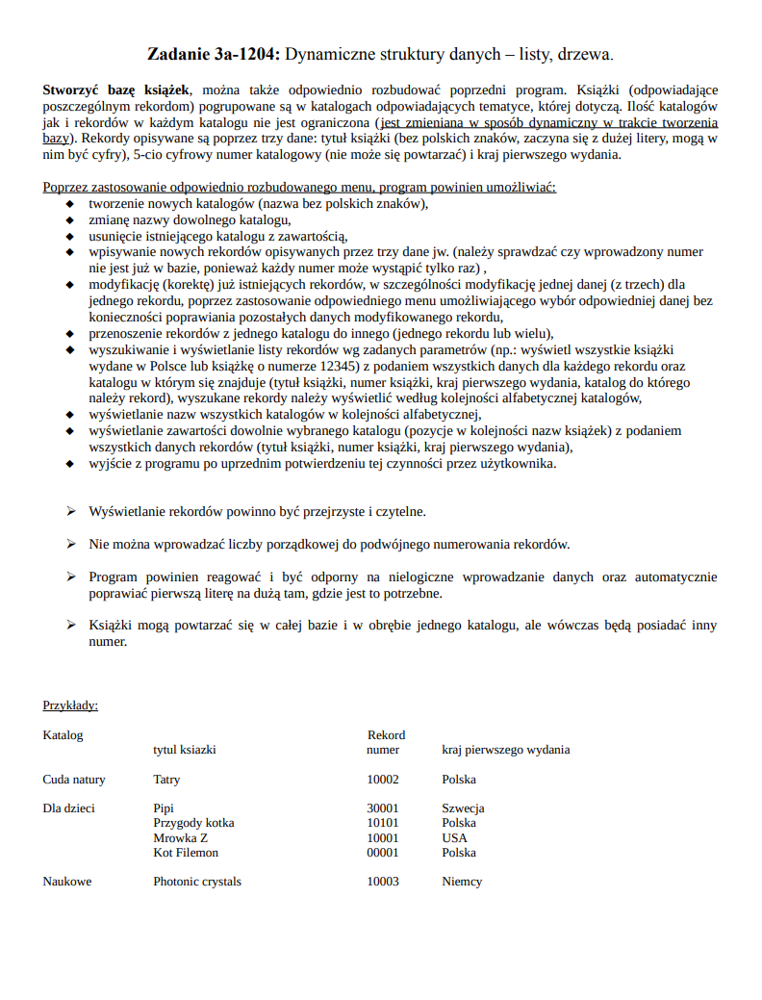

# CatalogedBookList
Program for creating, editing and displaying cataloged book lists made using lists

## Table of contents
* [General info](#general-info)
* [Technologies](#technologies)
* [Features](#features)

## General info
Project made for subject Programming Basics on the 1. semester on Warsaw University of Technology

Task description (unfortunately only in polish):

## Technologies
* C

## Features
By using an appropriately expanded menu, the program enables:
- creating new directories
- renaming any directory
- deleting an existing content directory
- entering new records described by the three data as above. (the program checks whether the entered number
is no longer in the database because each number can only appear once)
- modification (correction) of already existing records, in particular modification of one data (out of three) for one record, through the use of an appropriate menu that allows selecting the appropriate data without the need to correct other data of the modified record
- moving records from one directory to another (one record or many)
- searching and displaying a list of records according to given parameters (e.g. display all books published in Poland or a book with the number 12345) with all the data for each record and the directory in which it is located (book title, book number, country of first edition, catalog in which
must be a record), found records should be displayed in alphabetical order of directories
- listing the names of all directories in alphabetical order
- displaying the contents of any selected catalog (items in the order of book names) with all record data (book title, book number, country of first publication)
- exit from the program after confirmation of this action by the user
- The program is responsive and resistant to illogical data input and automatically corrects the first letter to uppercase where it is needed.
